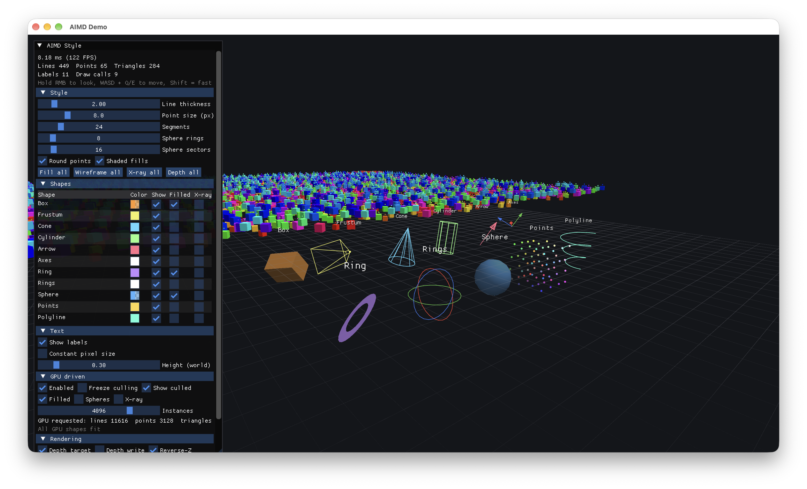

# AIMD

**Amélie's Immediate Mode Debug renderer.** Draw debug shapes from the CPU or directly from GPU shaders, on top of [agfx](ThirdParty/agfx) (D3D12, Metal 4, Vulkan).



## Features

- **Shapes:** lines, polylines, points, triangles, quads, boxes (AABB and oriented), frustums, cones, cylinders, arrows, axes, circles, rings, gizmo rings, UV spheres, grids.
- **Styles:** per-shape color, filled or wireframe, shading, depth tested or always on top, round or square points.
- **Pixel-sized lines and points:** thickness is in pixels, with anti-aliasing and near-plane clipping. They're expanded in the vertex shader.
- **3D text anchors:** AIMD projects labels and hands them to your UI library (ImGui, …) to draw.
- **GPU-driven mode:** emit the same shapes from your compute shaders, for example straight from your culling pass. AIMD draws them with indirect draws and can grow its buffers automatically.
- **C API:** plain C, implemented in C++.

## Integration

Copy the three files in [`dist/`](dist) into your project:

| File | What it is |
|---|---|
| `dist/aimd.h` | The whole library as a single header: C API, plus the implementation under `AIMD_IMPLEMENTATION` |
| `dist/AIMD.hlsl` | AIMD's shaders, compile them with agfx_shader and hand the modules to `aimdContextCreate` |
| `dist/AIMDDebug.hlsli` | Only for the GPU-driven path: include it from your own shaders |

In exactly one C++17 file:

```cpp
#define AIMD_IMPLEMENTATION
#include "aimd.h"
```

Include `aimd.h` without the define anywhere else, from C or C++. AIMD needs [agfx](ThirdParty/agfx). If you build with xmake, you can also depend on the `aimd` target, which compiles `Source/` directly.

`dist/` is generated from `Include/`, `Source/` and `Shaders/` with `xmake amalgamate`. Building the demo regenerates it too, so don't edit it by hand.

## Usage

### CPU

```c
aimdContextCreateInfo info = {0};
info.device = device;
info.framesInFlight = 3;
info.lineVertexShader = ...;     // Compiled from AIMD.hlsl: LineVS, PointVS, TriangleVS, MainPS
info.pointVertexShader = ...;
info.triangleVertexShader = ...;
info.fragmentShader = ...;
aimdContextCreate(&info);

// Anywhere during the frame
aimdSetColor(AIMD_RGBA(255, 128, 0, 255));
aimdSetFilled(1);
aimdSphere((aimdVec3){ 0, 1, 0 }, 0.5f);
aimdText((aimdVec3){ 0, 2, 0 }, "Hello");

// Once per frame
aimdExecuteInfo exec = {0};
exec.commandBuffer = cmd;
exec.colorTarget = colorTarget;   // In RENDER_TARGET state
exec.colorFormat = colorFormat;
exec.depthTarget = depthTarget;   // Optional, in DEPTH_WRITE state
exec.depthFormat = AGFX_TEXTURE_FORMAT_DEPTH32F;
exec.width = width;
exec.height = height;
memcpy(exec.view, view, sizeof(exec.view));
memcpy(exec.projection, projection, sizeof(exec.projection));
exec.frameIndex = frameIndex;
exec.textCallback = DrawLabels;   // Draw aimdTextCommands with your UI library
aimdExecute(&exec);
```

Matrices are column-major with column vectors (the glm layout), and clip depth is `[0, 1]`. Set `reverseZ` in the execute info if you use reverse-Z.

### GPU

To use GPU mode, create the context with `enableGpu = 1` and pass it `finalizeComputeShader` (`FinalizeCS` from `AIMD.hlsl`). Then call `aimdGpuBeginFrame` each frame and pass the handle it returns to your shaders:

```c
uint32_t handle = aimdGpuBeginFrame(cmd, frameIndex); // AIMD_GPU_INVALID_HANDLE if GPU mode is off
// ... dispatch your compute shaders with 'handle', then aimdExecute() as usual
```

```hlsl
#include "AIMDDebug.hlsli"

AIMDDebugRenderer renderer = AIMDDebugRenderer::Create(handle);
renderer.SetColor(float4(0.0, 1.0, 0.0, 1.0));
renderer.SetFilled(true);
renderer.DrawBox(instanceTransform);
```

AIMD records every barrier your GPU passes need. With `gpuAutoGrow`, AIMD reads a few counters back each frame and resizes its buffers when shapes didn't fit.

## Building

Requires [xmake](https://xmake.io). It fetches SDL3, Dear ImGui and glm for the demo.

```sh
xmake
xmake run aimd_demo
```

In the demo, hold the right mouse button to look around, move with WASD, and use Q/E for down and up. The ImGui panel controls every style option and the GPU-driven scene.

## Layout

| Path | Contents |
|---|---|
| `dist/` | Ready-to-copy single-header build and shaders (generated) |
| `Include/aimd/aimd.h` | Public API |
| `Source/` | Implementation |
| `Shaders/AIMD.hlsl` | AIMD's shaders |
| `Shaders/AIMDDebug.hlsli` | HLSL API for GPU-driven drawing |
| `Scripts/amalgamate.lua` | Generates `dist/` (`xmake amalgamate`) |
| `Demo/main.cpp` | Every AIMD integration step, in one file |
| `Demo/Showcase.*` | CPU-side shapes and the ImGui style panel |
| `Demo/GpuScene.*`, `Demo/Shaders/GpuScene.hlsl` | GPU-driven shapes from a compute pass |
| `Demo/Platform.*` | Window, device, swap chain, ImGui (no AIMD) |
| `ThirdParty/` | agfx, plus the shader compiler and ImGui backend used by the demo |
